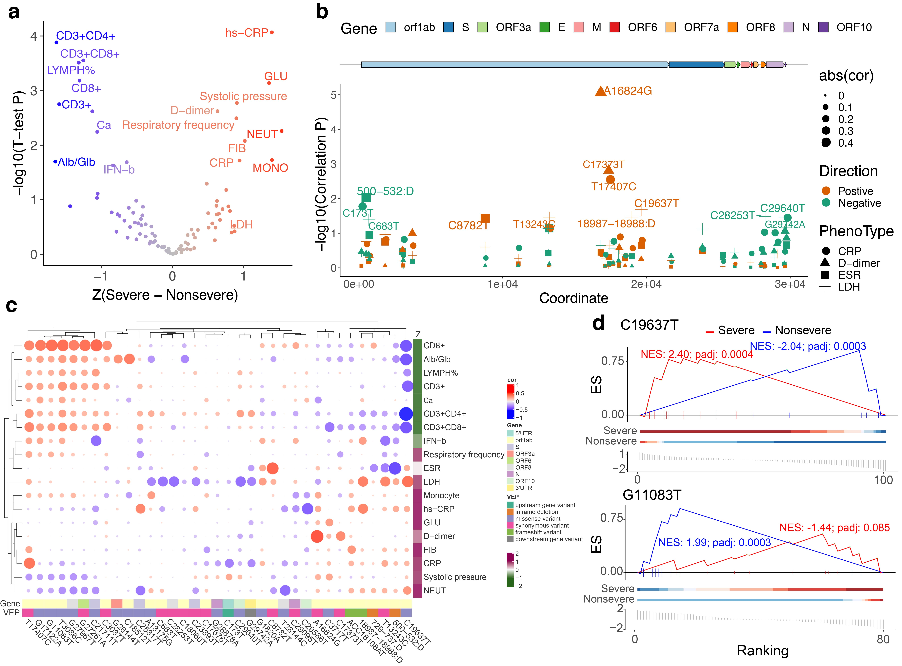

# **Genomic Monitoring of SARS-CoV-2 Reveals Viral Diversity associated with Severity**
### Baowen Du, Minjin Wang, Chao Tang, Chuan Chen, Yongzhao Zhou, Mingxia Yu, Hancheng Wei, Yuancun Zhao, Ran Zhou, Zhidan Li, Yiming Zhang, Chengdi Wang, Li Chen, Xia Xiao, Xiuran Zheng, Ruirui Yang, Danrui Wang, Yaoyao Zhang, Lifang Zhou, Shasha Chen, Ling Cao, Feng Luo, Ming Zhang, Mengjiao Li, Wei Fan, Ke Sun, Xinqiong Li, Kaiju Li, Yichen Yan, Yi Zha, Lingyu Jiang, Changxiu Yu, Yingfen Liu, Zhiyong Xu, Qingfeng Li, Yongmei Jiang, Guangwen Lu, Yuquan Wei, Lu Cheng, Thomas Connor, Weimin Li, Jingwen Lin, Jia Geng, Binwu Ying, Lu Chen

This repository contains the main scripts necessary to reproduce the analyses and presented figures of the manuscript.

## Summary

SARS-CoV-2 virus that causes COVID-19 pandemic is undergoing constant mutation. Despite extensive efforts to characterize its genetic diversity, the relationship between observed viral genomic variation and clinical outcome is largely unknown. We sought to address these questions through an integrative approach combining epidemiology, virus genome sequencing, clinical phenotyping and experimental validation. Bringing together 20 hospitals and institutes in two provinces in China, we implemented a Nanopore sequencing method to generate 141 SARS-CoV-2 genomes from 88 patients from eight cities in Sichuan, and validate the variants in 169 samples from 160 patients from Hubei. Within our dataset we identified 35 variants found in multiple SARS-CoV-2 genomes and found 7 genetic variants that are associated with clinical traits which correlate with COVID-19 severity. Our virologic surveillance characterized recurrent genetic diversity, and identified mutations of biological and clinical importance, which collectively will aid molecular diagnostics and vaccine design and may inform patient management.

## Dependencies

- R v3.6.0
- bestNormalize v1.5.0
- caret v6.0-84
- ComplexHeatmap v2.0.0
- fgsea v1.10.0
- gggenes v0.4.0

## Analysis

1. Genotype

   To obtain the exact base resolution support fraction of each variant, we processed the raw reads using the Guppy software v3.4.5 (https://nanoporetech.com/nanopore-sequencing-data-analysis), and output basecalled fastq files were concatenated and demultiplexed using qcat v1.1.0 (https://github.com/nanoporetech/qcat). SeqTK (https://github.com/lh3/seqtk) was then used to trim 30 bp from both ends to eliminate primer sequences. The resulting fastq files from Nanopore sequencing were mapped to the SARS-CoV-2 genome using bwa v0.7.17-r118816. For each base pair of the genome, we further calculated the fraction of evidence supported for seven possible outcomes, that is, A, T, C, G, insertion, deletion and N which means no reads covering this site from aligned bam file. The fraction was then calculated only when a position has more than 10 reads.

2. Clinical normalization

   All traits were normalized using the following steps: 1) *transformation*: first all data were transformed with inverse normal transformation using bestNormalize R package1; 2) *regress out confounding covariates*: potential covariates were tested (age, gender) for association with phenotypes using stepwise linear regression using caret R package (https://topepo.github.io/caret/), adjustment for covariates was thus only undertaken given evidence of association between covariate and phenotype. 3) *standardization*: traits were residualised in the previous step and then were standardized with a mean of zero and SD of 1.

3. Association

   Then Pearson correlation coefficient is calculated between the preprocessed traits and recurrent variants support fraction (**Fig b,c**).

4. Ranked enrichment

   To identify the potential genetic variants that are related to the severity of COVID-19, we used an enrichment analysis, akin to Gene Set Enrichment Analysis (GSEA) for interpreting gene expression data2. The goal of this enrichment analysis is to determine whether members of a trait set (***S***) that associated with a variant tend to randomly distribute throughout or occur toward the top (or bottom) of the list (***L***) that are non-severe or server related. When a trait set related to the phenotypic distinction, severe or non-severe in this case, tend to show the latter distribution. First, we defined two lists (***L***) of traits: non-severe related traits (n=8) and severe related traits (n=11) using the following criteria: a) *Non-severe* related traits were selected when a trait has a significant higher value in non-severe group from the 117 traits (P < 0.05, T-test). This includes CD3+, CD3+CD4+, CD3+CD8+ , CD8+ , LYMPH% , IFN-β, Alb/Glb and Ca. b) *Severe* related traits were selected when a trait has a significant higher value in severe group from the 117 traits (P < 0.05, T-test). This includes CRP, D-dimer, FIB, GLU, NEUT, hs-CRP, Monocyte, Respiratory frequency and Systolic pressure. Elevated LDH and ESR level were typical phenotype in severe COVID-19, they were added into severe-related traits, albeit not significant in our test (**Fig a**). Second, all clinical traits of each variant are ranked based on the difference between sample with (fraction > 0.2) and without the variant. Finally, we followed GSEA to calculated an enrichment score (ES) which is the maximum deviation from zero encountered in the random walk, a normalized ES (NES), a p value for significance level of ES, and adjusted p value using permutation (**Fig d**).

## Reference

1. Ordered quantile normalization: a semiparametric transformation built for the cross-validation era.” *Journal of Applied Statistics*, 1-16. doi: [10.1080/02664763.2019.1630372](https://doi.org/10.1080/02664763.2019.1630372).
2. Subramanian, A. *et al.* Gene set enrichment analysis: A knowledge-based approach for interpreting genome-wide expression profiles. *Proceedings of the National Academy of Sciences* **102**, 15545, doi:10.1073/pnas.0506580102 (2005).

